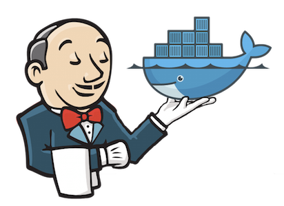
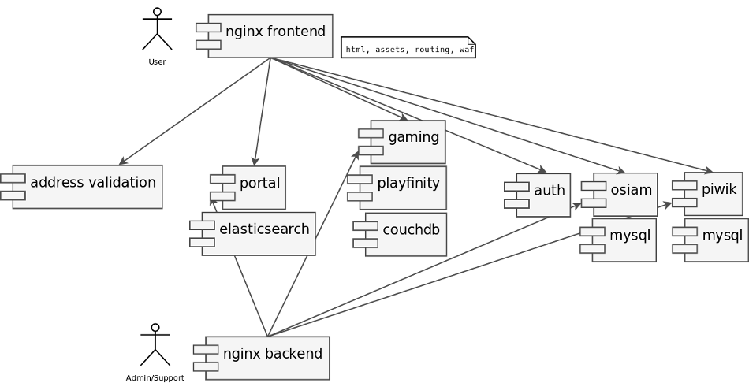
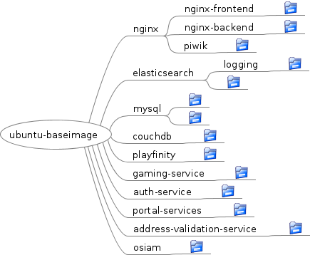
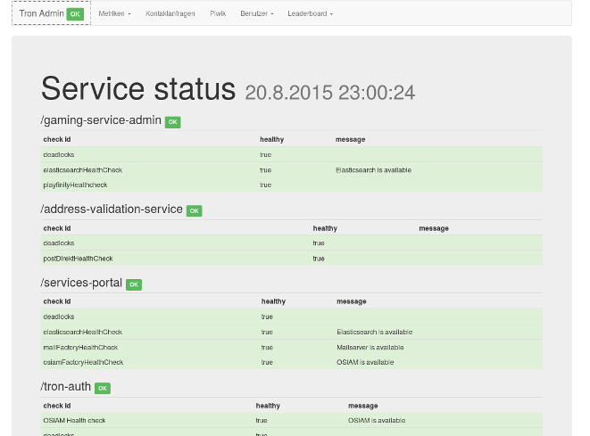

Warum Container
=================
* Trend zu Micro Services
* Einfaches und schnelles Deployen
* Klar definierte Deployment-Schnittstelle

Immutable Infrastructure
-------------------------
* Alles Services und Systeme werden in einem definierten Build-Prozess gebaut
* Daten und Dienste werden klar getrennt
* Ein Service wird nur gestartet und durch einen neuen ersetzt → niemals verändert
* Warum? __Vermeidung von unterschieden zwischen Entwicklung, Staging und Produktion__

Unterstützung der Entwicklung
===============================

Microservices stellen nicht nur Ops vor Herausforderungen:

- Entwickler müssen die Plattform in einer bestimmten Version lokal zum Laufen bringen
- Die lokale Installation sollte der auf Produktion möglichst ähnlich sein
- Lokal muss es möglich sein
  - Services einfach gegen Entwicklungsversionen auszutauschen
  - Services schnell neu zu starten (<5 Sekunden)

Warum nicht Vagrant?
-----------------------
Natürlich auch eine Option, aber häufig:

- Schwerfälliger / langsamer
- Aufwändiger alles auf eine/wenige VMs zu integrieren

Voraussetzungen für Docker
===============================

DevOps:
----------

- Durchgehende Build-, Test- und Deployment-Automatisierung
- Gelebtes DevOps: “You Build It, You Run It”

Warum ist das so wichtig?
----------------------------

Es muss möglich sein auch für kleine Änderungen die komplette Build-Pipeline zu durchlaufen

Immer Docker?
====================

Wann ich kein Docker einsetzen würde:

- Wenn Software-Entwicklung und Betrieb getrennt sind.

- Wenn keine aktive Entwicklung der Plattform geplant ist: Einmal entwickelt und nie wieder angepackt.

- Wenn schon andere ausgereifte Lösungen im Einsatz sind.

Immer Docker?
====================

Buzzerdeal.de
=================

Casual Gaming Plattform der Deutschen Post 

Herausforderungen
=================

Schnelle Entwicklung (erstes Release nach ca. 8 Wochen).

Agile ständige Weiterentwicklung.

Entwicklung und Betrieb aus einer Hand.

Hohe Sicherheitsvorgaben (Deutsche Post)

- Sicherheitskonzept
- Code- und Architektur-Audit
- Pen Testing
- Nachvollziebarer Erstellungsprozess

Hohe Qualitätsansprüche:

- Automatisierte Tests (Unit, Komponenten, UI)
- Staging-Umgebungen:

  Lokal ⇨ Test ⇨ Referenz ⇨ Produktion

Herausforderungen
====================

Technologieauswahl:
-------------------
Nutzung bestehender Komponenten in unterschiedlichen Technologien.

- Benutzerverwaltung: OSIAM (Java/tomcat)
- Scoring: Playfinity (NodeJS)
- Tracking: Piwik (PHP)
- Neue Komponenten (Java/dropwizard)

Deployment:
------------
- Docker: __Ja__
- Zusätzliche Komplexität: __Nein!__

Das einfachste Tool, das die Anforderungen unterstützt ohne zusätzliche komplexität hinzu zu bringen.

Buzzerdeal.de - Architektur
=============================
Viele kleine Services & Nginx als Router

Rollout der Container
=============================
Was wir nicht brauchten:
------------------------
- Breite Verteilung oder dynamische Skalierung

Was wir nicht wollten:
-----------------------
- Cloud Management tools
- Komplexe Orchestrierung
- docker-compose (Damals fig: zu viel dev, zu wenig prod)
- Weiteres Config-Management (Puppet, Chef, ..)

Lösung:
-----------
- docker deamon als service supervisor (`--restart=always`)
- Kleines selbst geschriebenes Helferlein zum Rollout: `gig`

gig
=================
<https://github.com/smancke/gig>

- MIT License
- Verwendet YAML-Dateien analog zu docker-compose
- Voll über Shell-Variablen parametrisierbar 
- Direkter Aufruf in der Entwicklung (Java)
- Generiert ein Shell-Script für die Nutzug auf _Test_ und _Produktion_
- ~800 loc inkl. Java + Shell

gig - Kommandos
=================
Übersicht der `gig` Kommandos:

    Usage: gig COMMAND [service..]
    Calling comands without arguments means all services.
    
        status (default)    shows the running status of each container
        start               start the existing containers, if already up
        stop                stop containers
        restart             stop containers and then start them
        restartrm           stop containers, remove them and then start again
        update              rm and start container if a newer image exists
                               start container if not running
        rollout             pull images and do update
        rm                  remove the containers
        ps                  execute ps for the containers
        versions            shows json of the image versions and *.version
        tag -t <tag>        tags the images with the supplied version
        pull                pulls the images from the registry
        push                push the images to the registry
        save-logs -d <dir>  save the container logs to the target dir
        help                print the list of commands

gig Config Beispiel
===========================
    nginxBackend:
      image: $DOCKER_REGISTRY/nginx-backend:$TAG_NGINX_BACKEND
      ports:
        - "$ADMIN_IP:80:80"
        - "$ADMIN_IP:443:443"
      volumes:
        - nginx-backend/ssl/server.key:/etc/nginx/server.key
        - nginx-backend/ssl/server.crt:/etc/nginx/server.crt
    
    piwik:
      image: $DOCKER_REGISTRY/piwik:$TAG_PIWIK
      links:
        - "piwikmysql:db"
      ports:
        - "$PRIVATE_IP:4200:80"
      volumes:
        - piwik/config/config.ini.php:/analytics/config/config.ini.php
    
    piwikmysql:
      image: $DOCKER_REGISTRY/mysql:$TAG_MYSQL
      volumes:
        - $DATA_DIR/piwikmysql:/var/lib/mysql
      environment:
        MYSQL_ROOT_PASSWORD: $MYSQL_ROOT_PASSWORD_PIWIK

Environments
=================

Ziel:
-------

Umgebungen unterscheiden sich nur durch wenige Konfigurationsparameter und Dateien.

Lösung:
--------

- Die Plattform-Beschreibung ist per Shell-Variablen konfigurierbar.
- Die Config-Files aller Dienste sind mit Umgebungsvariablen überschreibbar
- Von außen wird nur gesetzt, was in den Umgebungen unterschiedlich ist. Alles andere wird im image _hart_ konfiguriert

Beispiel:

    org.osiam.auth-server.db.url=jdbc:mysql://db:3306/osiam
    org.osiam.auth-server.db.username=root
    org.osiam.auth-server.db.password=${MYSQL_ROOT_PASSWORD_OSIAM}

Lokale Entwicklung
====================
* Lokal können alle oder ausgewählte container gestartet werden
* Ersetzen von Containern gegen lokal gestartete Dienste (z.B. aus der IDE)
* Dev-Verzeichnisse können lokal in den Container gemoutet werden um Roundtrip-Zeiten zu vermeiden

Images bauen
========================
Base images selber bauen!

- Kontrolle von Upstream Änderungen
- Aufbau der eigenen Images auf wenige Base-Images
- Security: Vertauen ist gut - eigene Images sind besser!

Buzzerdeal Image Hierarchie
-----------------------------

Versionierung
=================
- Wie kann ich den Source-Code-Stand eines Containers finden?
- Auf welche Images baut mein Image auf?
- Wie kann ich vermeiden, dass sich zu viele Image-Versionen ansammeln?

Way to go:
-----------
- Builds überschreiben immer den Stand `latest` → Das spart Plattenplatz!
- Keine Unterscheidung zwischen CI-Builds und Release-Builds.
- Eine Version, die ausgerollt werden soll bekommt nach erfolgreichem Test ein Tag. (`gig tag` und `gig push`)
- Branches vermeiden (Lieber schnell vorwärts rollen und toggeln).
- Niemand außer _Jenkins_ pushed images in die Registry!!!

Version Files
=============================
Jeder Build legt eine Textdatei: `<imagename>.version` im Image ab:

 - Imagename
 - Build Datum
 - Git commit id
 - Jenkins build id

Mit `gig versions` werden alle Version-Files eines Images ausgegeben:

    "tron_nginxBackend": {
      "image": "tron-registry.lan.tarent.de/nginx-backend:latest",
      "imageHash": "de1ddbe6b6d1",
      "versionFiles": [
        "nginx-backend,2015-05-13:09:09:43,d04f6f56,nginx_backend-150",
        "nginx,2015-05-13:09:08:49,c20bbb7e,nginx_baseimage-71",
        "ubuntu-baseimage,2015-05-12:23:00:48,d351f4e4,ubuntu_baseimage-58"
    ]},
    "tron_nginx": {
      ...

Logging & Monitoring
======================
- Log Stacks - aktuell:
  - Wackelig: Logspout + curl + ELK
  - Konventionelles Sichern der Logs (gig save-logs)
  - Umstieg auf docker native appender, z.b. fluentd + elasticsearch + kibana
- Logspout
  - <https://github.com/gliderlabs/logspout>
  - Lauscht auf neue Container, stellt die Logs per HTTP zur Verfügung
- Cadvisor
  - <https://github.com/google/cadvisor>

Health-Checks
==============
Jeder Service hat http-Entpunkte `/health` und `/metrics`

Abfrage und Anzeige in einem Dashboard & shell-script & auf allen Umgebungen

Learnings:
=================
* Container müssen unabhängig deploybar sein
* Container selbst müssen schnell starten

Danke
================
[Slides auf github](https://github.com/smancke/talks/tree/master/2015_froscon_docker_in_production)
