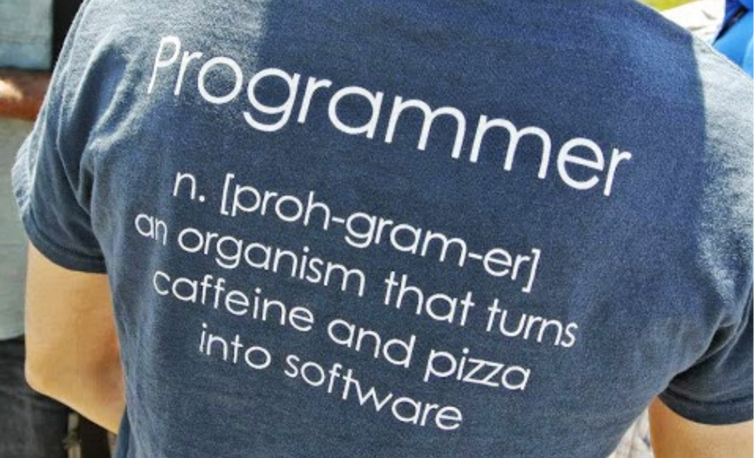
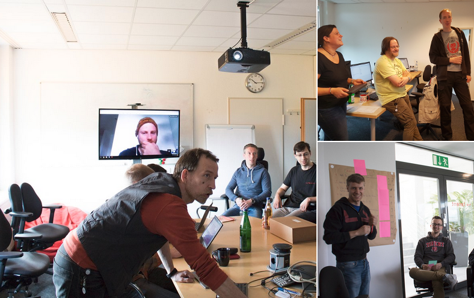
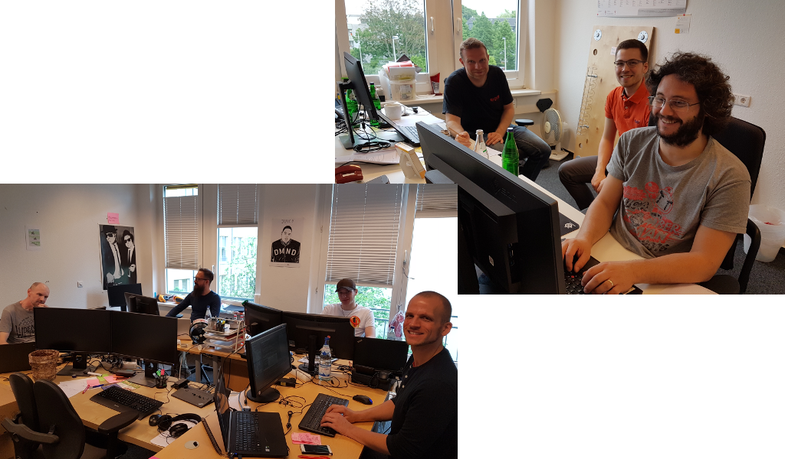
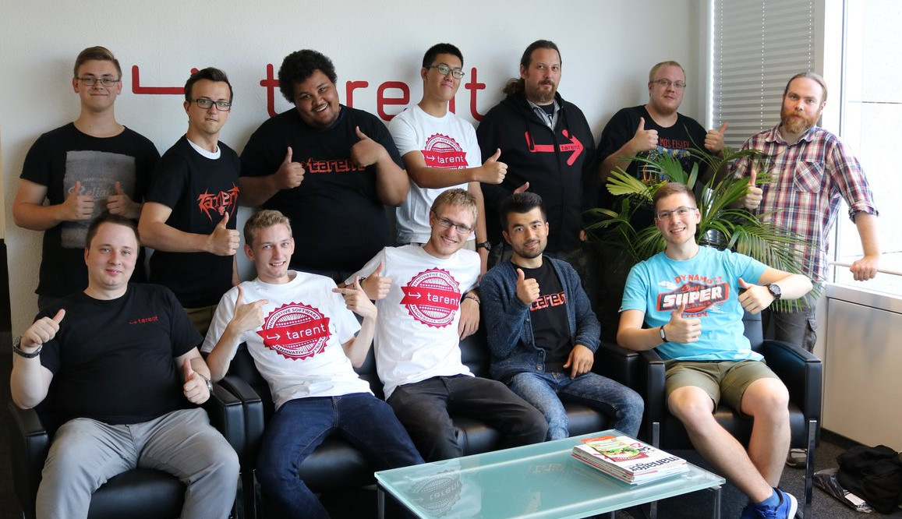

# Wer bin ich?

__Name:__ Sebastian Mancke

__Rolle:__ head of technology

## Wo arbeite ich?

tarent solutions GmbH, Bonn Duisdorf

# Woran Arbeiten wir?

# Mein Werdegang

## Ausbildung
* Schule: Informatik Unterricht, Abi 1999
* Nebenbei Webseiten erstellt
* Informatik Studium Uni Bonn
* Als Student in diversen Fimen gejobbt

## Beruf
* 2004 Gestartet als Softwareentwickler
* 2006 Entwicklungsleiter
* 2007 Teilhaber
* 2012-2013 Geschäftsführer (Management)
* 2014- head of technology (Zurück zur Technik)

# Was ist Code?

    type Todo struct {
    	Id           int    `json:"Id"`
    	Title        string `json:"Title"`
    	Category     string `json:"Category"`
    	Dt_created   string `json:"Dt_created"`
    	Dt_completed string `json:"Dt_created"`
    }

    type Server struct {
    	db *sql.DB
    }

    func main() {
        db, err := sql.Open("mysql", "root:@tcp(127.0.0.1:3306)/todo")
        if err != nil {
            log.Fatal(err)
        }
        db.SetMaxIdleConns(100)
	    defer db.Close()

	    server := &Server{db: db}
        ...
    
# Entwickler = Nerd?

# Kommunikation steht im Vordergrund

# So arbeiten wir

# So arbeiten wir

# Berufsbilder und Rollen

## Entwickler

Technische Konzeption und Programmierung

## Tester

Qualität der Software-Produkte

## Operations

Betrieb von Servern und Infrastrukturen

## Produktmanager

Fachliche Produktkonzeption

## Scrum Master

Steuerung der Organisation und Zusammenarbeit

# Ausbildung in der tarent

